#  Операционные системы UNIX/Linux 

## Part 1. Установка ОС

*Установи Ubuntu 20.04 Server LTS без графического интерфейса. (Используем программу для виртуализации - VirtualBox)

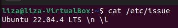

*Создай пользователя, отличного от созданного при установке. Пользователь должен быть добавлен в группу adm.

Создали пользователя:

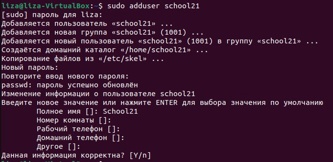

Проверяем командой:

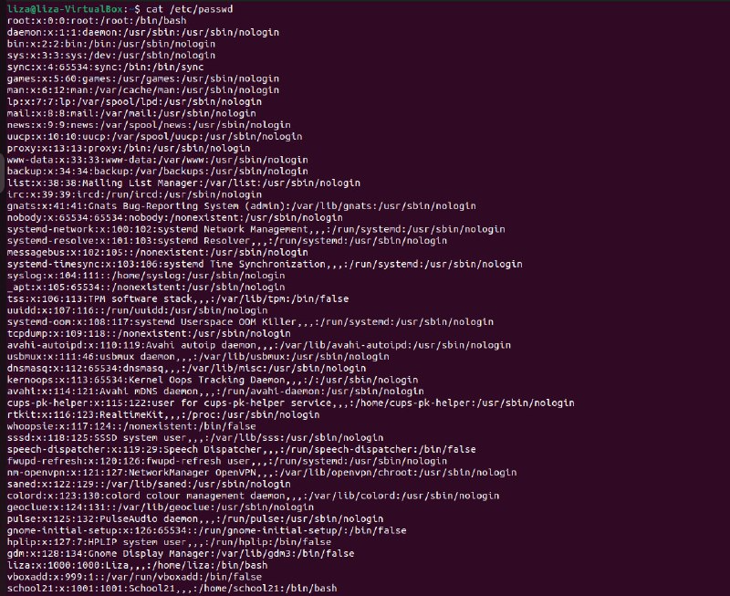

Добавляем в группу адм:

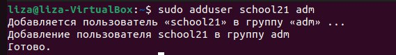

## Part 3. Настройка сети ОС

3.1 Задай название машины вида user-1.

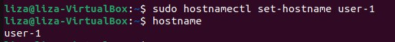

3.2 Установи временную зону, соответствующую твоему текущему местоположению.

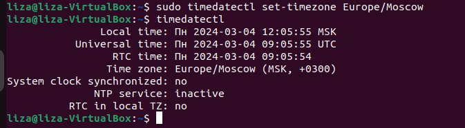

3.3 Выведи названия сетевых интерфейсов с помощью консольной команды.

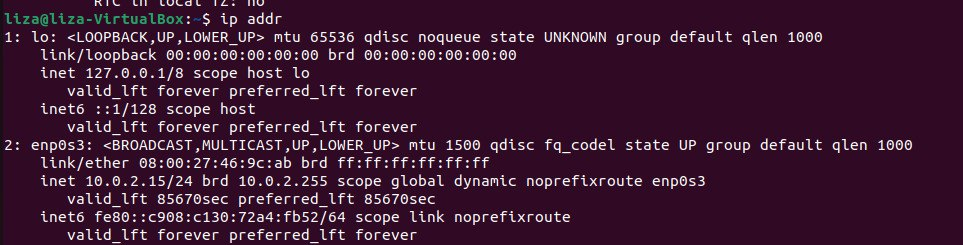

*В отчёте дай объяснение наличию интерфейса lo.
Интерфейс lo (loopback) присутствует по умолчанию в любом Linux и используется для обратной связи внутри устройства. Он предназначен для тестирования сетевых приложений на самом устройстве. Lo обычно имеет IP-адрес 127.0.0.1 (localhost), который всегда ссылается на устройство, где он находится.

3.4 Используя консольную команду, получи ip адрес устройства, на котором ты работаешь, от DHCP сервера.

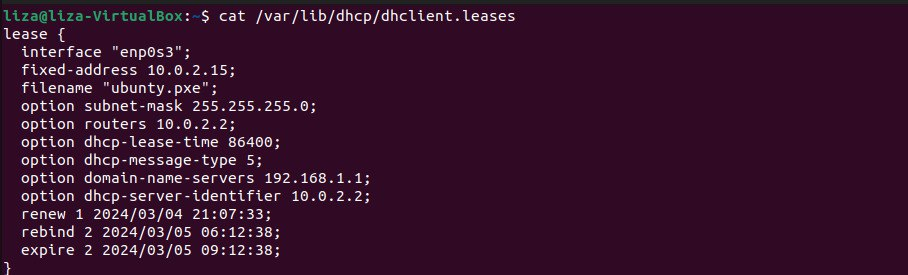

*В отчёте дай расшифровку DHCP.
DHCP расшифровывается как "Dynamic Host Configuration Protocol" (Протокол динамической конфигурации хоста). Этот протокол используется в сетях для автоматической настройки сетевых параметров на устройствах, подключенных к сети. DHCP позволяет устройствам автоматически получать IP-адрес, шлюз по умолчанию, DNS-серверы и другие сетевые параметры. Основные функции DHCP: выделение IP-адресов, настройка шлюза по умолчанию, предоставление DNS-серверов, настройка других параметров.

3.5 Определи и выведи на экран внешний ip-адрес шлюза (ip) и внутренний IP-адрес шлюза, он же ip-адрес по умолчанию (gw).

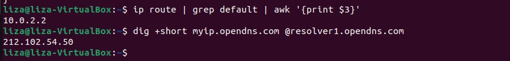

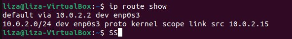

3.6 Задай статичные (заданные вручную, а не полученные от DHCP сервера) настройки ip, gw, dns (используй публичный DNS серверы, например 1.1.1.1 или 8.8.8.8).

Задаем вручную статичстические настройки:
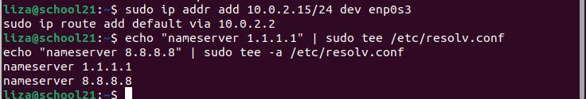

Перезугаружаем машину и проверяем:
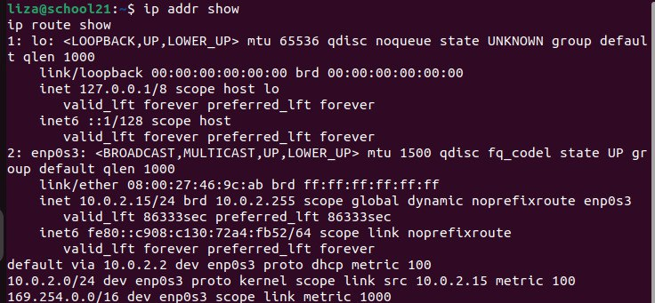

*Пропингуй удаленные хосты 1.1.1.1 и ya.ru и вставь в отчёт скрин с выводом команды.
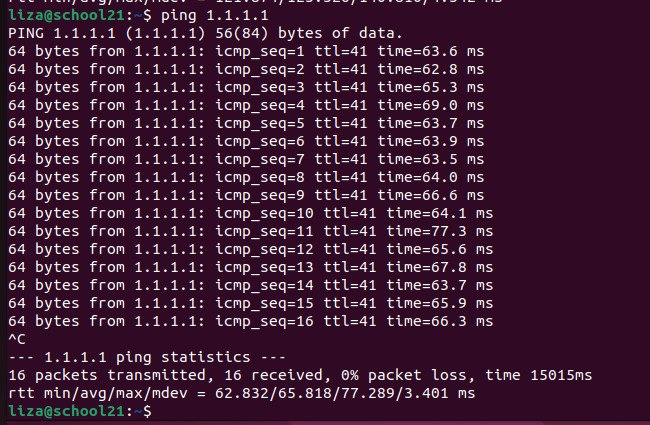
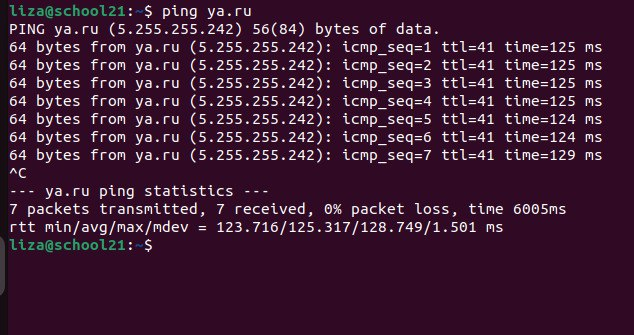

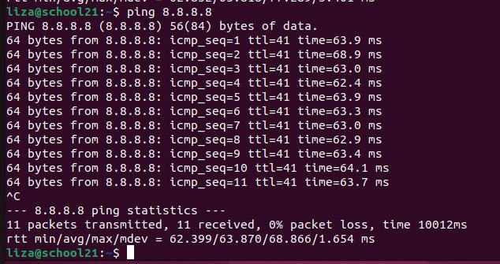

## Part 4. Обновление ОС

Обнови системные пакеты до последней на момент выполнения задания версии.

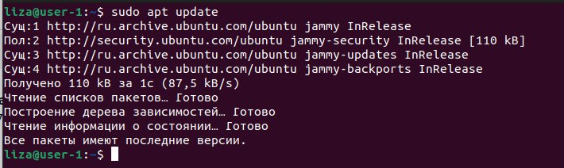

Все пакеты обновлены до плоследней версии.

## Part 5. Использование команды sudo

5.1 Разреши пользователю, созданному в Part 2,выполнять команду sudo.

Проверяем 

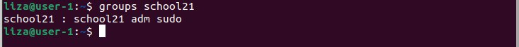

*В отчёте объясни истинное назначение команды sudo:
Команда sudo предоставляет возможность пользователям выполнять команды от имени суперпользователя root, либо других пользователей, у которых есть права.

5.2 Поменяй hostname ОС от имени пользователя, созданного в пункте Part 2 (используя sudo);

Сначала перезайдем под пользователем school21 (su - school21) и командой sudo hostnamectl set-hostname school21-1 поменяем имя хоста:

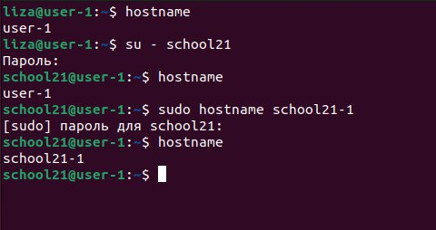

Перезагружаем и проверяем:

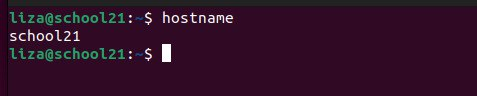

## Part 6. Установка и настройка службы времени

Настрой службу автоматической синхронизации времени.

6.1 Выведи время часового пояса, в котором ты сейчас находишься.
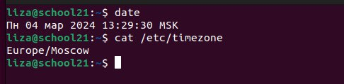

6.2 Вывод следующей команды должен содержать NTPSynchronized=yes: 
timedatectl show
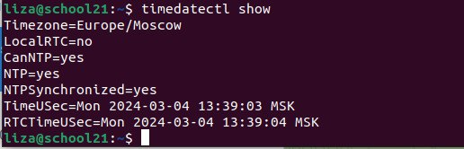

Для автоматической синхронизации я использовала : sudo apt install systemd-timesyncd(установила systemd-timesyncd) и sudo systemctl enable --now systemd-timesyncd(запускаю и включаю службу systemd-timesyncd)

## Part 7. Установка и использование текстовых редакторов

7.1 Установи текстовые редакторы VIM (+ любые два по желанию NANO, MCEDIT, JOE):

*Установим  редакторы vim,nano и joe:
sudo apt update
sudo apt install vim nano joe

7.2 Используя каждый из трех выбранных редакторов, создай файл test_X.txt, где X -- название редактора, в котором создан файл. Напиши в нём свой никнейм, закрой файл с сохранением изменений.

* vim test_vim.txt
Чтобы сохранить файл и выйти из редактора vim, нажмем Esc чтобы переключиться в обычный режим, введем :wq и нажмем Enter:

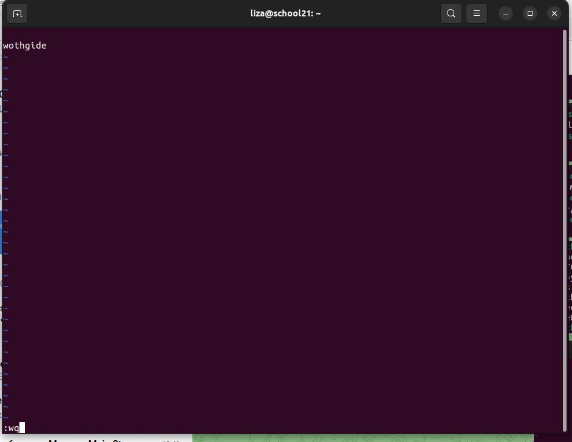

* nano test_nano.txt
Для сохранения CTRL + O и ENTER,, далее чтобы выйти из nano, вводим CTRL + X.

*  joe test_joe.txt
Для сохранения и выхода: Нажмите Ctrl + K, затем X, затем enter для подтверждения.

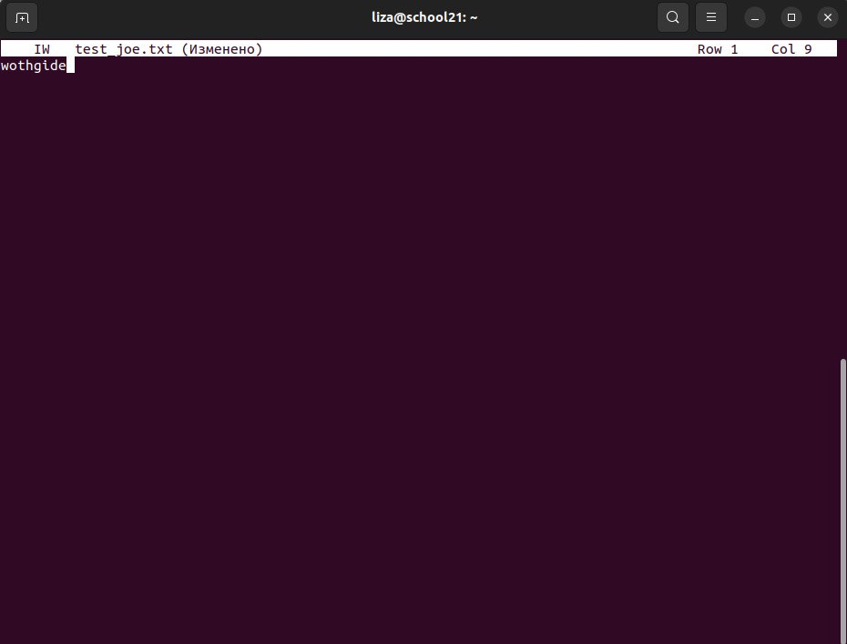

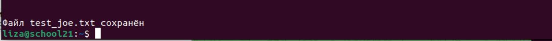

7.3 Используя каждый из трех выбранных редакторов, открой файл на редактирование, отредактируй файл, заменив никнейм на строку «21 School 21», закрой файл без сохранения изменений.

* vim test_vim.txt
 Чтобы после редактирования закрыть файл без внесенных изменений: qa! и  Enter.

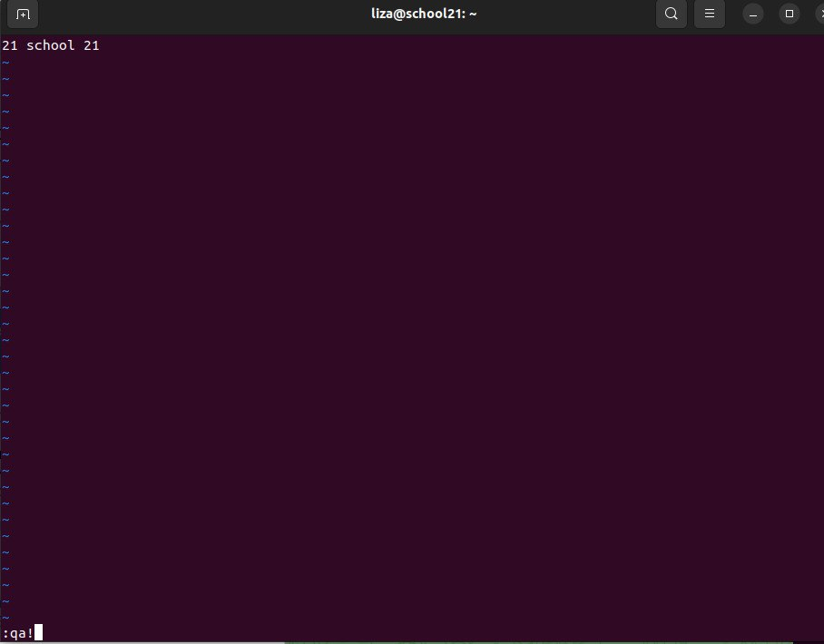

* nano test_nano.txt
Для выхода без сохранения: CTR + X, ввести N для отказа от сохранения изменений и Enter.

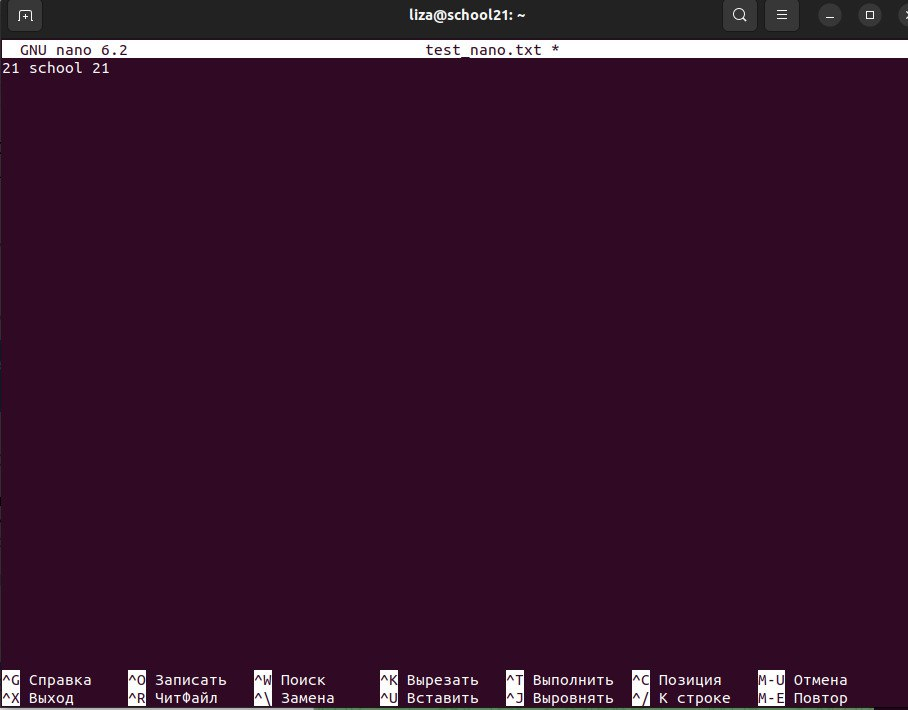

*  joe test_joe.txt
Для выхода из редактора joe без сохранения нужно использовать комбинацию Ctrl+С.

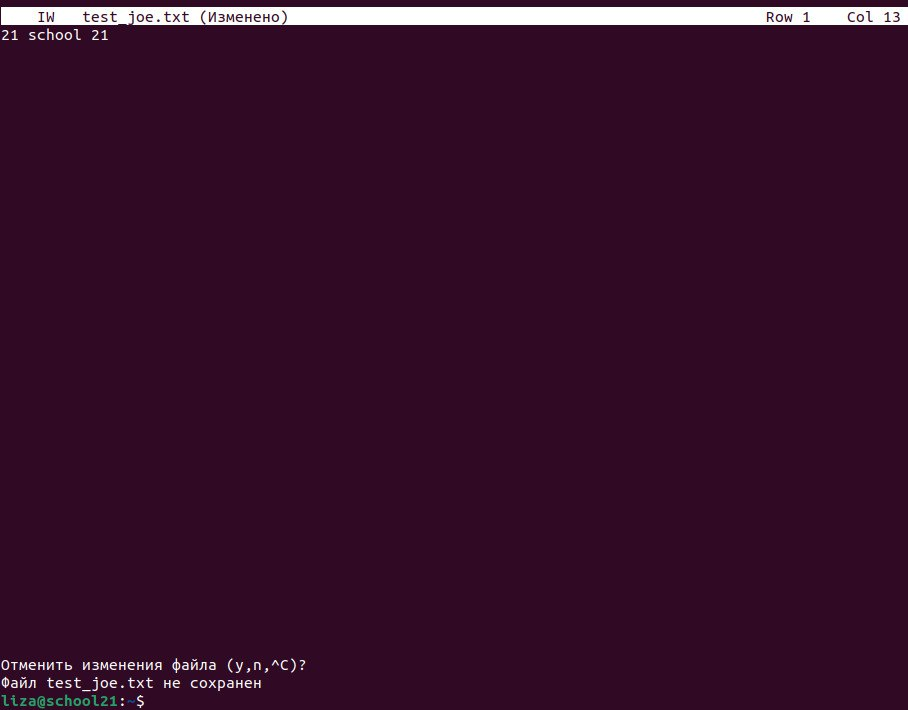

7.4 Используя каждый из трех выбранных редакторов, отредактируй файл ещё раз (по аналогии с предыдущим пунктом), а затем освой функции поиска по содержимому файла (слово) и замены слова на любое другое.

* vim test_vim.txt
Для поиска слова и замены его на другое, используем команду %s/\School\>/my cat/g

* nano test_nano.txt
Для поиска и замены нажмем Ctrl+\, введем строку, которую необходимо найти (school) и нажмем клавишу Enter. Затем введем строку, на которую произвести замену (ma cat) и нажмем Enter

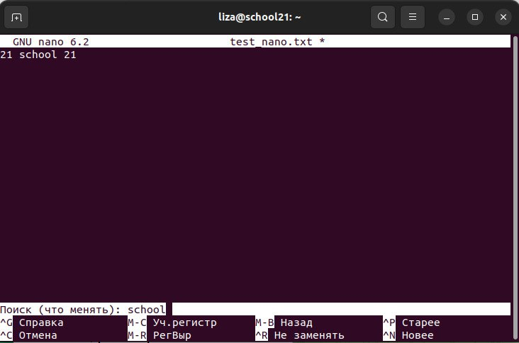

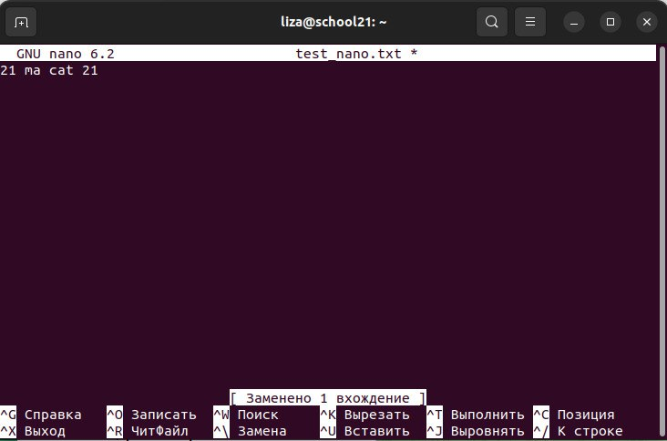

*  joe test_joe.txt
Для поиска слова нажимаем Ctrl+K затем f, после вводим school и ENTER подтверждаем замену r, вводим my cat и подтверждаем y.

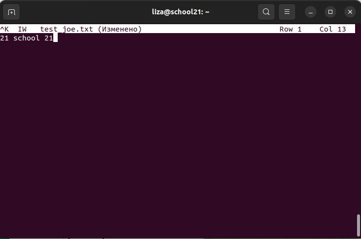

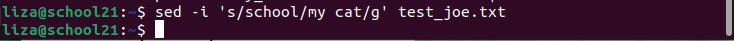

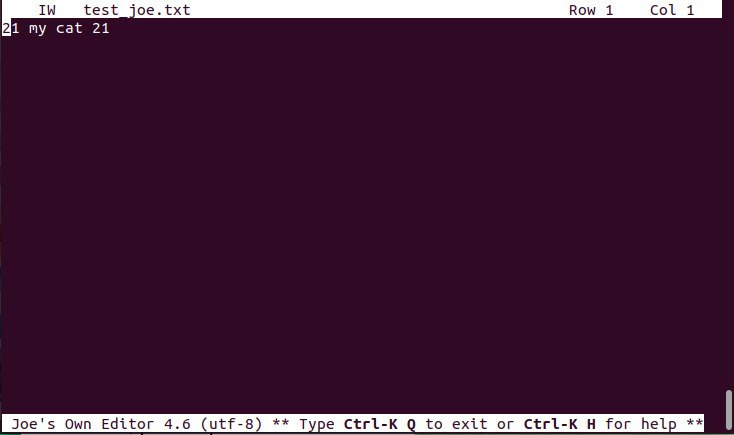

## Part 8. Установка и базовая настройка сервиса SSHD

8.1 Установи службу SSHd. Устанавливаем и проверяем:

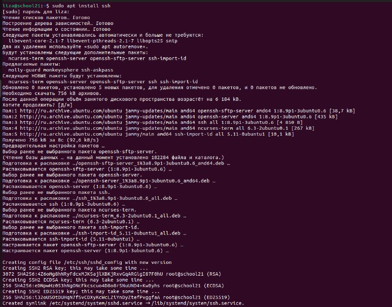

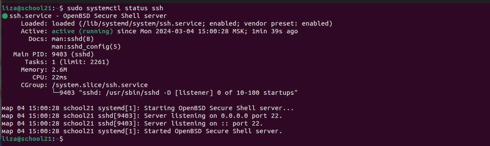

8.2 Добавь автостарт службы при загрузке системы.

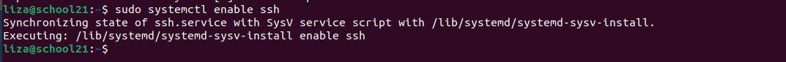

8.3 Перенастрой службу SSHd на порт 2022.

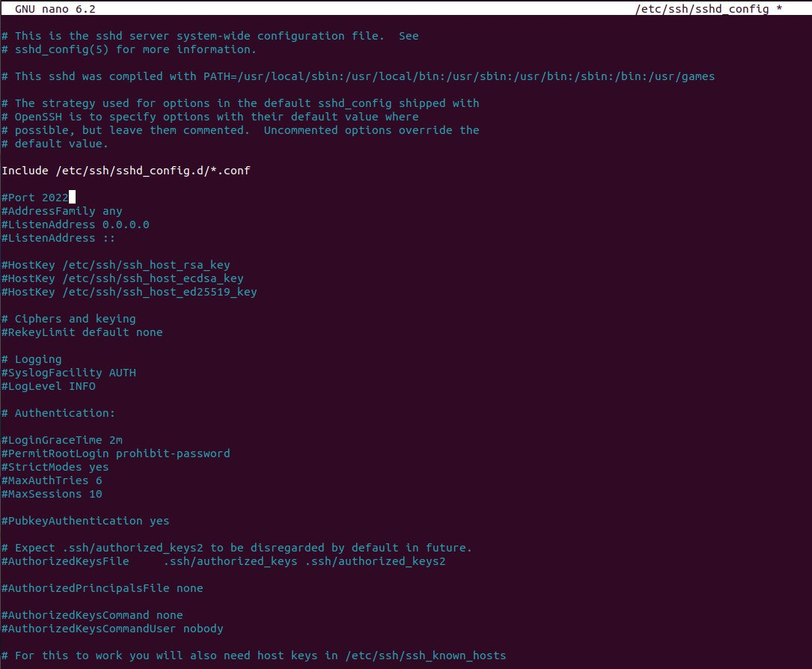

8.4 Используя команду ps, покажи наличие процесса sshd. Для этого к команде нужно подобрать ключи.
В отчёте объясни значение команды и каждого ключа в ней.

*Ps Выводит процессы, выполняющиеся в настоящее время от имени пользователя.

*Опции:
-aux Выводятся все процессы, выполняющиеся от имени всех пользователей (выводит статистику, время старта процесса и команду, которая его стартовала);
-e Все выполняющиеся процессы в системе;
-A, -e, (a) - выбрать все процессы;
-a - выбрать все процессы, кроме фоновых;
o -d, (g) - выбрать все процессы, даже фоновые, кроме процессов сессий;
-N - выбрать все процессы кроме указанных;
-С - выбирать процессы по имени команды;
-G - выбрать процессы по ID группы;
-p, (p) - выбрать процессы PID;
--ppid - выбрать процессы по PID родительского процесса;
-s - выбрать процессы по ID сессии;
-t, (t) - выбрать процессы по tty;
-u, (U) - выбрать процессы пользователя.

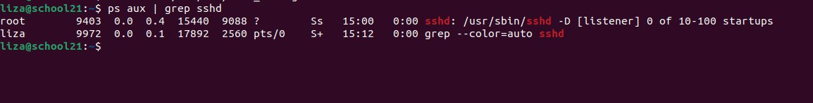

8.5 Перезагрузи систему.
После перезвгрузки проверяем работу службы SSHd:

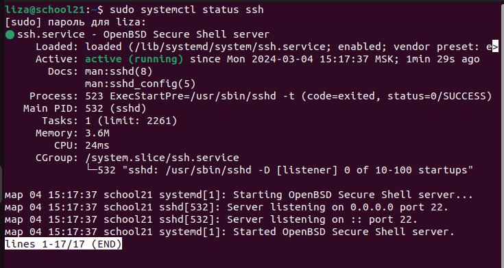

8.6 Вывод команды netstat -tan должен содержать  
tcp 0 0 0.0.0.0:2022 0.0.0.0:* LISTEN

Ключи команды netstat: - -t - протокол обмена данными для отчёта, tcp в этом случае - -a - отображение всех подключений и ожидающих портов - -n - отображение IP-адресов и номеров портов в цифровом виде

Proto - используемый протокол обмена данными, по ключу -t выбран tcp
Recv-Q - количество байт, не скопированных программой пользователя, подключенной к этому сокету(это данные которые приняты хостом и ожидающие обработки программой).
Send-Q - Количество байт, не подтвержденных удаленным хостом.
Local Address - адрес и номер порта локального конца сокета.
Foreing Address - адрес и номер порта удаленного конца сокета.
State - состояние сокета TCP (LISTEN - ожидает входящих соединения, т.е. открыт).
IP-адрес 0.0.0.0 может использоваться на серверах для обозначения того, что служба может связываться со всеми сетевыми интерфейсами. Он дает команду серверу «прослушивать» и принимать соединения с любого IP-адреса.

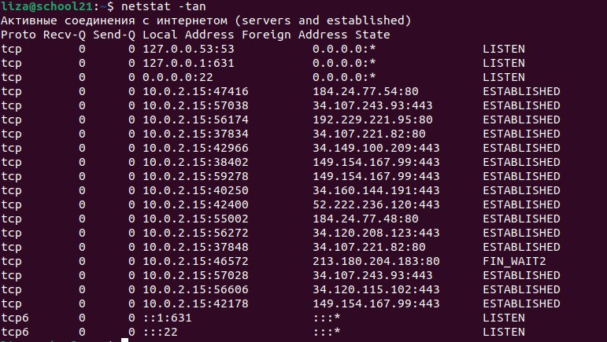

## Part 9. Установка и использование утилит top, htop

9.1 Установим и запустим утилиту top:

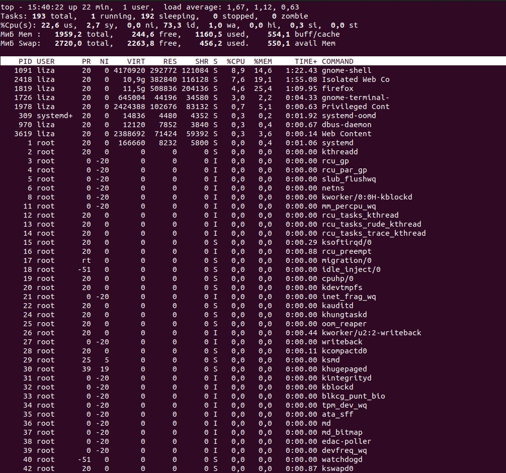

uptime: 15:40:22
количество авторизованных пользователей: 1 user 
общую загрузку системы: load average: 1,67 1,12 0,63
общее количество процессов: 193 total
загрузку cpu: 22,6 us 2,7 sy 0,0 ni 73,3 id 1,0 wa 0,0 hi 0,3 si 0,0 st
загрузку памяти:1959,2 total, 244,6 free 1160,5 used 554,1 buff/cache

pid процесса занимающего больше всего памяти:

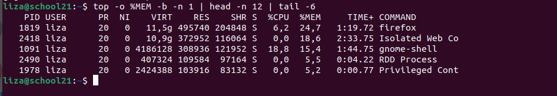

pid процесса, занимающего больше всего процессорного времени:

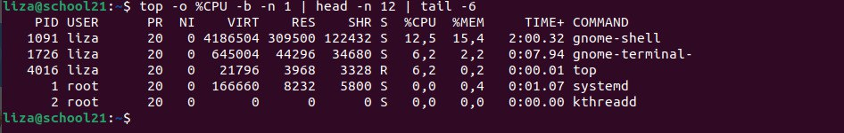

9.2 Установим и запустим утилиту htop:

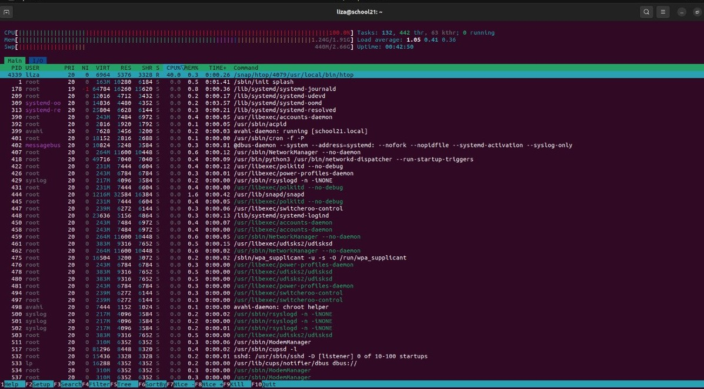

отсортированному по PID: 
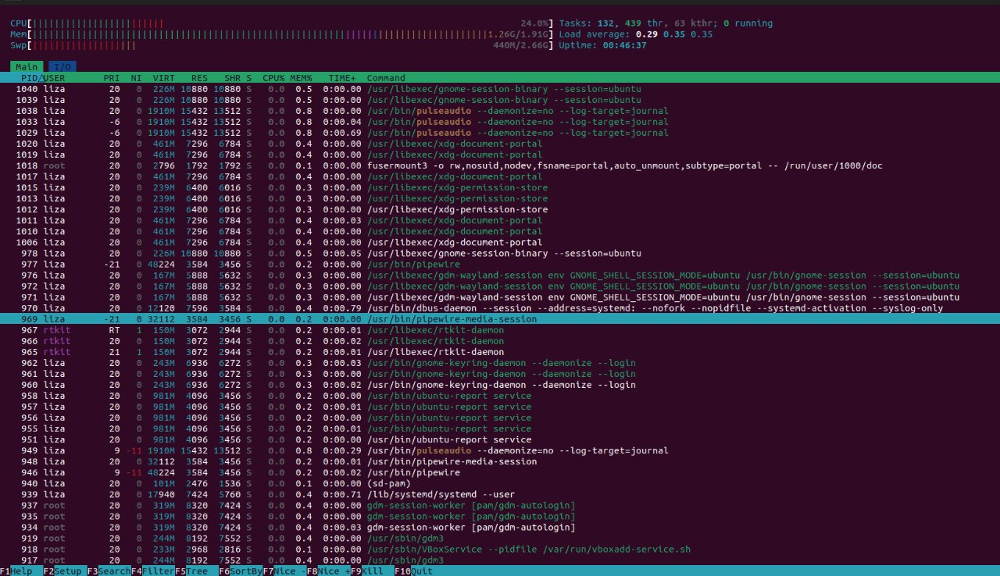
PERCENT_CPU:
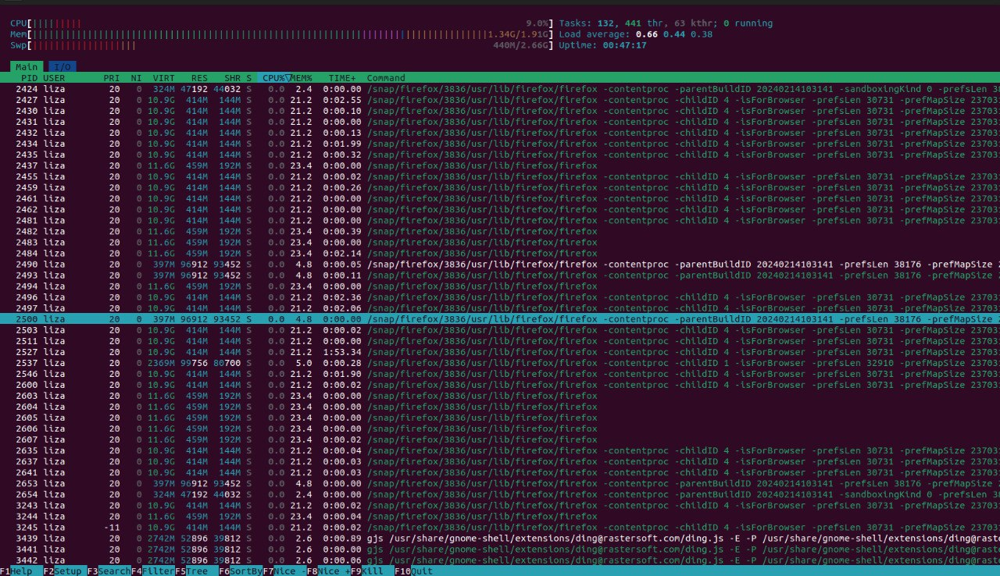
PERCENT_MEM:
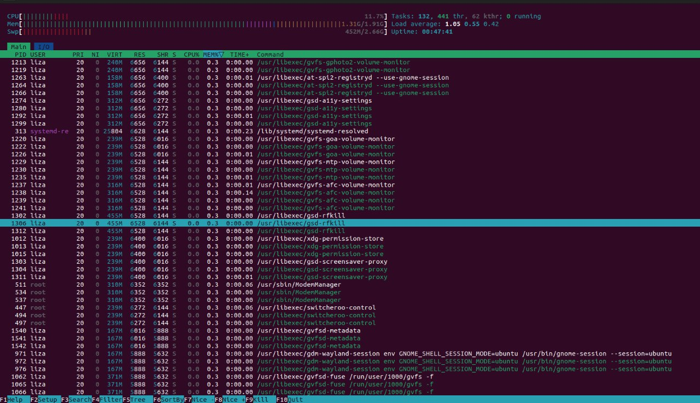
TIME:
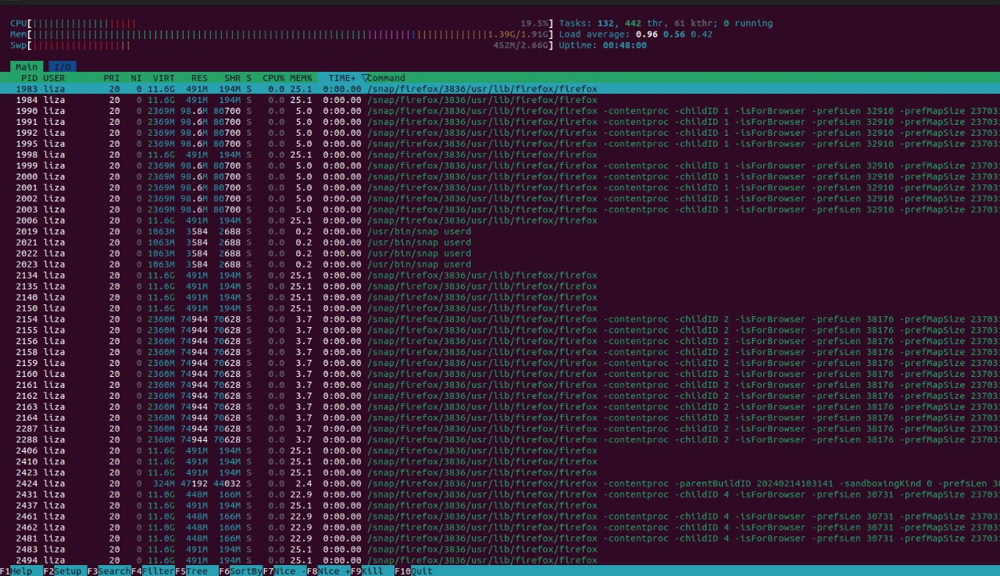

отфильтрованному для процесса sshd:
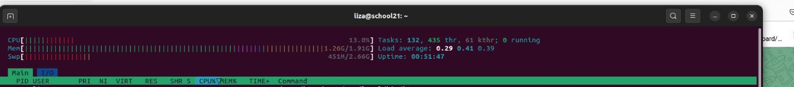

с процессом syslog, найденным, используя поиск:
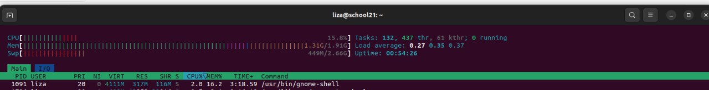

с добавленным выводом hostname, clock и uptime:
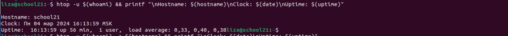

## Part 10. Использование утилиты fdisk

 название жесткого диска:VBOX HARDDISK
 размер: 25,35 гб
 количество секторов: 53164128

размер swap:


## Part 11. Использование утилиты df

11.1 Запуcкаем команду df 


для корневого раздела (/):

размер раздела: 25468140 кб
размер занятого пространства: 11374064 кб
размер свободного пространства: 12775012 кб
процент использования: 48%

11.2 Запускаем команду df -Th


для корневого раздела (/):

размер раздела: 25 Гб
размер занятого пространства: 11 Гб
размер свободного пространства: 13 Гб
процент использования: 48%
тип файловой системы для раздела: ext4

## Part 12. Использование утилиты du

12.1 Запусти команду du


12.2 Выведи размер папок /home, /var, /var/log (в байтах, в человекочитаемом виде)


12.3 Выведи размер всего содержимого в /var/log (не общее, а каждого вложенного элемента, используя *)


## Part 13. Установка и использование утилиты ncdu

13.1 Установи утилиту ncdu


13.2 Выведи размер папок /home, /var, /var/log

Размер папки /home:

Размер папки /var:

Размер папки /var/log:


## Part 14. Работа с системными журналами

14.1  /var/log/dmesg


14.2  /var/log/syslog


14.3 /var/log/auth.log


14.4 Напиши в отчёте время последней успешной авторизации, имя пользователя и метод входа в систему


Время авторизации: 15:17:48 Mar 4
имя пользователя: Liza
метод входа в систему: login

14.5 Перезапусти службу SSHd;


14.6 Вставь в отчёт скрин с сообщением о рестарте службы (искать в логах).


## Part 15. Использование планировщика заданий CRON

 Используя планировщик заданий, запусти команду uptime через каждые 2 минуты.

Для начала внесем строку */2 * * * * uptime
 в планировщик командой crontab -e:


Проверим выполнение команды uptime с интервалом 2 минуты: tail /var/log/syslog | grep "CRON":


Список текущих задач:

Удали все задания из планировщика заданий:

